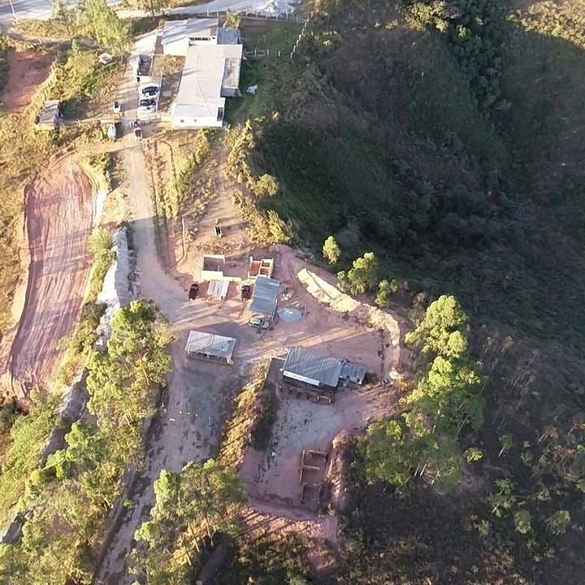

## Infraestrutura

O clube conta com espaços adequados para a prática, treinamento e instrução do tiro esportivo e defesa pessoal. Os principais equipamentos e áreas do clube são as salas de instrução/capacitação, espaços de convivência, oficina de armas e 10 estandes de tiro:

- Salas de aula:

- Estande fechado (indoor):

")

- Estande aberto (outdoor) 25 metros:

")

- Estande aberto (outdoor) 50 metros:

")

- Estande aberto (outdoor) 75 e 300 metros:

")

- Vista panorâmica do CLT:

- Oficina de armas de fogo com armeiro certificado pelo Exército e credenciado pela Polícia Federal.

