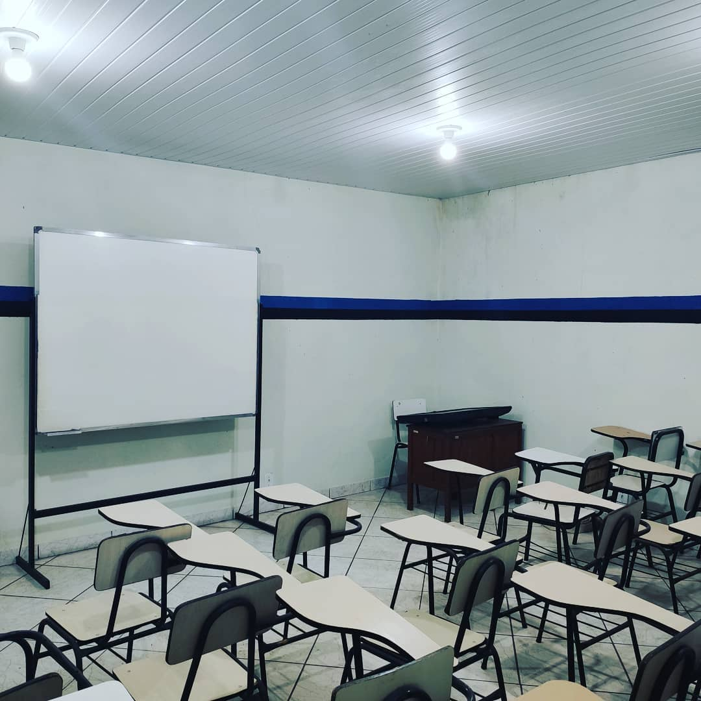

## Infraestrutura

O clube conta com espaços adequados para a prática, treinamento e instrução do tiro esportivo e defesa pessoal. Os principais equipamentos e áreas do clube são as salas de instrução/capacitação, espaços de convivência, oficina de armas e 10 estandes de tiro:

- Salas de aula:

- Estande fechado (indoor):

")

- Estandes abertos (outdoor) 25, 50, 75 e 300 metros:

")

")

")

- Oficina de armas de fogo com armeiro certificado pelo Exército e credenciado pela Polícia Federal.

-

- Dez estandes de tiro:
    
    - Estande de tiro de 10 metros para armas curtas em ambiente fechado (indoor).
    - Estande de tiro de 25 metros para carabinas e chumbinho em ambiente fechado.
    - Estande de tiro de 25 metros para armas curtas em ambiente aberto (outdoor).
    - Estande de tiro de 25 metros para carabinas de chumbinho em ambiente aberto.
    - Estande de tiro de 75 metros para armas longas em ambiente aberto.
    - Estande de tiro de 300 metros para fuzis em ambiente aberto.
    - Três estandes de tiro de 15 metros para Tiro Defensivo e IPSC (em breve).
    - Estande de tiro ao prato (trap) para espingardas (em breve).
